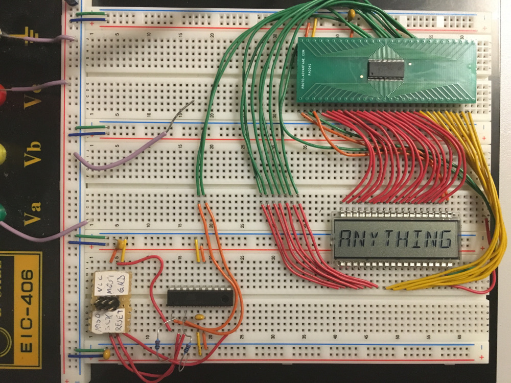
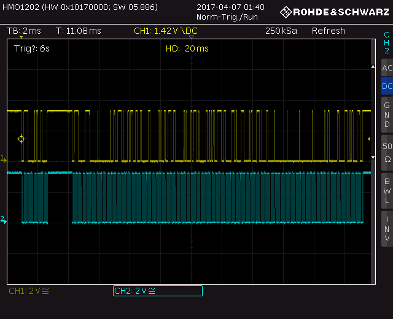
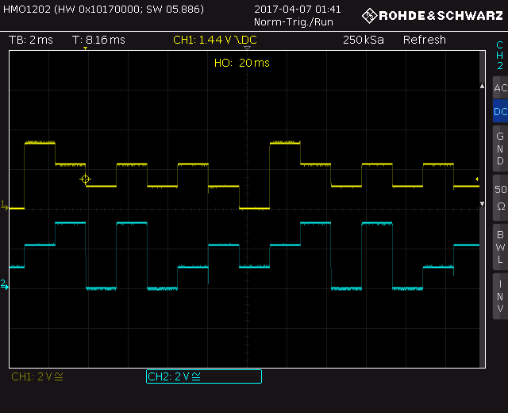

PCF8576 ATtiny Test
===================

* PCF8576 LCD Controller
* ATtiny861
* VIM-878-DP-FC-S-LV (8x 14 segment transflective LCD)

Breadboard setup
----------------

Oscilloscope screenshots
------------------------

